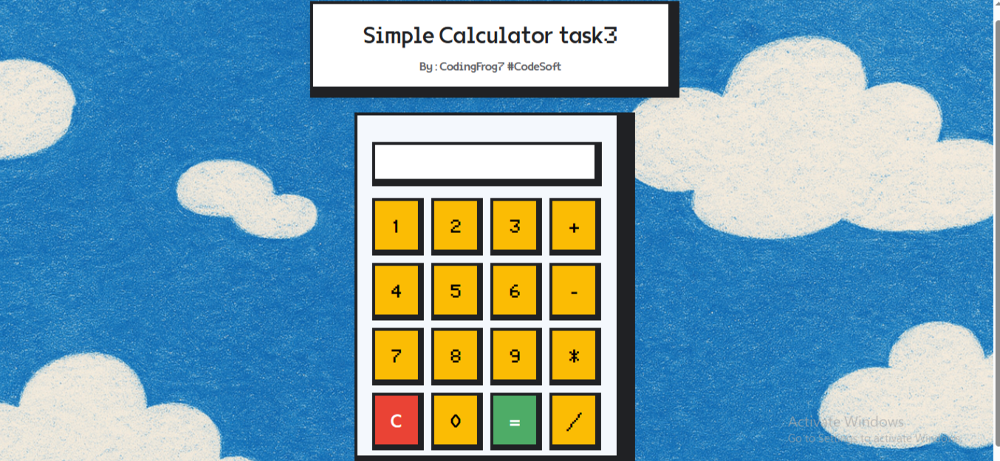

# 🔢 Calculator Web App

A sleek and responsive calculator built using **HTML**, **CSS**, and **JavaScript**.

---

## 🌐 Live Demo

[🚀 View Live Calculator](https://yourusername.github.io/calculator/)

---

## ✅ Features

- Basic calculator operations
- Responsive layout
- Clear and delete buttons
- Minimalist UI

---

## 🧰 Tech Stack

- HTML5
- CSS3
- JavaScript (ES6)

---

## 📷 Screenshots

